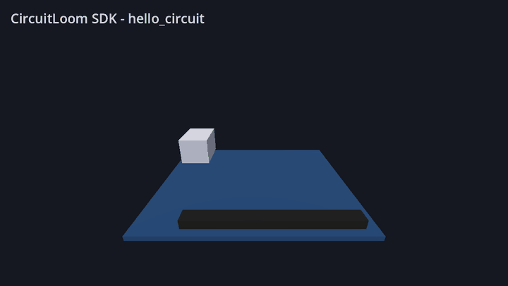

# CircuitLoom SDK

[](https://github.com/SergioAscurraPerez/circuitLoom-sdk/actions/workflows/ci.yml)
[](LICENSE)

> **Status: v0.1.0 — first public release.** The v1 circuit schema is versioned, but APIs
> may still change before 1.0. See the [CHANGELOG](CHANGELOG.md).

CircuitLoom SDK is an open-source **Godot Engine addon** for simulating real electronic
circuits — the same components found in an Arduino UNO starter kit (LEDs, resistors,
buttons, buzzers, servos, potentiometers, an ultrasonic sensor, a protoboard) — as a
serializable, event-driven graph that games and interactive learning tools can build on.

## Positioning: why not Fritzing, Wokwi, or a similar simulator?

Tools like **Fritzing** (schematic/PCB design) and **Wokwi** (browser-based Arduino
simulator) are built to *design and validate a circuit as a standalone artifact* — you
open them, wire a circuit, check it, and export it. They are not meant to be embedded
inside another real-time application, and they don't expose their circuit model as
something a game engine can drive, render in 3D, or react to at runtime.

CircuitLoom SDK targets a different gap: **circuit simulation as a reusable building
block inside a game or interactive experience**, not as a destination tool. Concretely:

- **Godot-native, not a separate app.** It ships as a Godot addon (GDScript), installable
  from the Godot Asset Library, so it lives inside the same project as the game/lesson
  that uses it — no external simulator window, no import/export round-trip.
- **A serializable graph, not a black box.** The circuit is modeled explicitly as nodes
  (components/pins) and edges (wires), versioned (`v1`), so any consumer — a rules
  engine, a custom UI, a save file — can read and write the same structure.
- **Event-driven by design.** Consumers react to `on_short_circuit`,
  `on_component_damaged`, and `on_circuit_valid` without touching the internals of the
  rules engine, which is what makes it usable inside a game loop instead of only a
  one-shot validation pass.
- **3D and feedback-ready.** Real-scale glTF component models, standard wire color coding, and
  ready-to-use spark/smoke failure effects come with the SDK, so an interactive scene
  doesn't have to be built from scratch to *look and feel* like a real circuit.

In short: Fritzing and Wokwi answer "is this circuit correct?" as a standalone question.
CircuitLoom SDK answers "how does this circuit behave, live, inside my game?" — aimed at
educators and game developers building electronics-learning experiences (e.g. an
Arduino-UNO-compatible teaching sandbox), not circuit designers producing a finished
schematic.

## Demo



An Arduino UNO next to a breadboard with the v1 starter-kit components on it. Three
circuits are checked in turn: an LED with its resistor (`on_circuit_valid`, the LED
lights up), a bare wire from 5V to GND (`on_short_circuit`, sparks and smoke on the
Arduino's power header) and an LED with no series resistor (`on_component_damaged`, the
LED burns out). Source:
[`examples/hello_circuit/demo_scene.gd`](examples/hello_circuit/demo_scene.gd).

## Installation

Requires **Godot 4.5+**. It takes about two minutes:

1. Download **Source code (zip)** from the latest
   [release](https://github.com/SergioAscurraPerez/circuitLoom-sdk/releases) (or use
   **Code > Download ZIP**). The zip only contains the addon, the license and these docs.
2. Copy the `addons/circuitloom_sdk/` folder from the zip into your project's `addons/`
   folder, so you end up with `res://addons/circuitloom_sdk/plugin.cfg`.
3. In Godot, open **Project > Project Settings > Plugins** and enable
   **CircuitLoom SDK**.

Installing from the Godot Asset Library will be available once the SDK is listed there.

## Quick start

Create a `CircuitMonitor`, connect to the events you care about, and hand it a circuit
(a [schema v1](docs/circuit-graph-schema.md) document):

```gdscript
extends Node3D

const FailureEffects := preload("res://addons/circuitloom_sdk/src/effects/failure_effects.gd")


func _ready() -> void:
	var monitor := CircuitMonitor.new()

	monitor.on_circuit_valid.connect(func(): print("circuit is valid"))
	monitor.on_component_damaged.connect(func(details): print("damaged: ", details))
	monitor.on_short_circuit.connect(
		func(_details): FailureEffects.spawn_short_circuit(self, Vector3(0, 0.05, 0))
	)

	var text := FileAccess.get_file_as_string("res://my_circuit.json")
	monitor.check(JSON.parse_string(text))
```

A runnable version with three sample circuits lives in
[`examples/hello_circuit/`](examples/hello_circuit/), explained step by step in
[`docs/events.md`](docs/events.md).

## What's inside

The circuit data model is a versioned, serializable graph — see
[`docs/circuit-graph-schema.md`](docs/circuit-graph-schema.md) — a simplified rules
engine computes voltage/current per node on top of it — see
[`docs/rules-engine.md`](docs/rules-engine.md) — and `CircuitMonitor` exposes that as
three events (`on_short_circuit`, `on_component_damaged`, `on_circuit_valid`) consumers
can connect to from outside the core — see [`docs/events.md`](docs/events.md). The 10
components modeled for v1 — the same ones in a typical Arduino UNO starter kit — have
specs verified against real datasheets and a real-scale glTF model each, with a primitive
placeholder as fallback — see [`docs/components.md`](docs/components.md) and
[`docs/models.md`](docs/models.md). A ready-to-use spark/smoke reference effect
ships for short-circuit feedback — see [`docs/effects.md`](docs/effects.md).

## Contributing

Contributions are welcome — see [CONTRIBUTING.md](CONTRIBUTING.md) for the commit
convention, PR process, and how to run lint/tests locally. Please also read our
[Code of Conduct](CODE_OF_CONDUCT.md).

## License

MIT — see [LICENSE](LICENSE).
